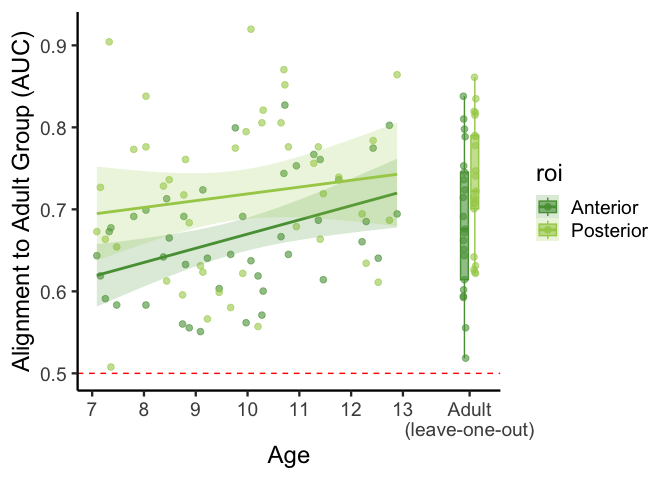
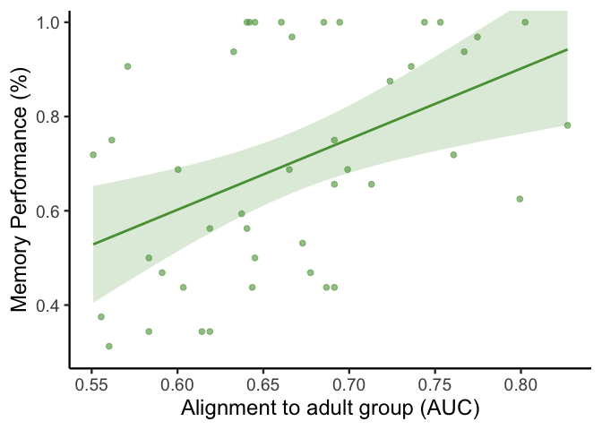

auc_regression
================
2026-01-09

## Run and plot AUC-based regression to compare classifier generalization by age

``` r
data = read.csv('data/final_classifier_data.csv')

sub <- subset(data, age < 18)
```

### model AUC changes by age within each subregion, controlling for tSNR, \# voxels, attention, and sex

``` r
m <- lm(auc_ant ~ age + tsnr_ant + nvoxs_ant + attn_r4 + sex, data = sub)
summary(m)
```

    ## 
    ## Call:
    ## lm(formula = auc_ant ~ age + tsnr_ant + nvoxs_ant + attn_r4 + 
    ##     sex, data = sub)
    ## 
    ## Residuals:
    ##       Min        1Q    Median        3Q       Max 
    ## -0.119748 -0.047386  0.006865  0.044618  0.130479 
    ## 
    ## Coefficients:
    ##               Estimate Std. Error t value Pr(>|t|)  
    ## (Intercept)  0.2653813  0.1169680   2.269   0.0290 *
    ## age          0.0130269  0.0062263   2.092   0.0431 *
    ## tsnr_ant     0.0039673  0.0041351   0.959   0.3434  
    ## nvoxs_ant    0.0002970  0.0001377   2.157   0.0374 *
    ## attn_r4     -0.0186717  0.0460736  -0.405   0.6876  
    ## sexM        -0.0093652  0.0213651  -0.438   0.6636  
    ## ---
    ## Signif. codes:  0 '***' 0.001 '**' 0.01 '*' 0.05 '.' 0.1 ' ' 1
    ## 
    ## Residual standard error: 0.0642 on 38 degrees of freedom
    ## Multiple R-squared:  0.2838, Adjusted R-squared:  0.1896 
    ## F-statistic: 3.012 on 5 and 38 DF,  p-value: 0.02189

``` r
m <- lm(auc_post ~ age + tsnr_ant + nvoxs_ant + attn_r4 + sex, data = sub)
summary(m)
```

    ## 
    ## Call:
    ## lm(formula = auc_post ~ age + tsnr_ant + nvoxs_ant + attn_r4 + 
    ##     sex, data = sub)
    ## 
    ## Residuals:
    ##       Min        1Q    Median        3Q       Max 
    ## -0.150802 -0.068396  0.002214  0.060374  0.203141 
    ## 
    ## Coefficients:
    ##               Estimate Std. Error t value Pr(>|t|)    
    ## (Intercept)  0.6777796  0.1765957   3.838 0.000455 ***
    ## age          0.0093873  0.0094003   0.999 0.324297    
    ## tsnr_ant    -0.0034925  0.0062431  -0.559 0.579158    
    ## nvoxs_ant    0.0002241  0.0002078   1.078 0.287817    
    ## attn_r4     -0.1579604  0.0695609  -2.271 0.028910 *  
    ## sexM        -0.0228402  0.0322565  -0.708 0.483216    
    ## ---
    ## Signif. codes:  0 '***' 0.001 '**' 0.01 '*' 0.05 '.' 0.1 ' ' 1
    ## 
    ## Residual standard error: 0.09693 on 38 degrees of freedom
    ## Multiple R-squared:  0.1538, Adjusted R-squared:  0.04243 
    ## F-statistic: 1.381 on 5 and 38 DF,  p-value: 0.2531

### adults do not differ from adolescents

``` r
data <- data %>%
  mutate(age_group = case_when(
    age < 10 ~ 'child',
    age < 13 & age >= 10 ~ 'adolescent',
    age >= 18 ~ 'adult',
    TRUE ~ NA_character_  
  ))

data$age_group <- relevel(factor(data$age_group), ref = 'adult')
m <- lm(auc_ant ~ age_group + tsnr_ant + nvoxs_ant + attn_r4 + sex, data = data)
summary(m)
```

    ## 
    ## Call:
    ## lm(formula = auc_ant ~ age_group + tsnr_ant + nvoxs_ant + attn_r4 + 
    ##     sex, data = data)
    ## 
    ## Residuals:
    ##       Min        1Q    Median        3Q       Max 
    ## -0.190959 -0.045819 -0.000609  0.051671  0.142225 
    ## 
    ## Coefficients:
    ##                       Estimate Std. Error t value Pr(>|t|)    
    ## (Intercept)          0.4986354  0.1187175   4.200  9.3e-05 ***
    ## age_groupadolescent  0.0014781  0.0254752   0.058   0.9539    
    ## age_groupchild      -0.0429710  0.0243093  -1.768   0.0824 .  
    ## tsnr_ant             0.0060517  0.0041938   1.443   0.1544    
    ## nvoxs_ant            0.0001225  0.0001071   1.144   0.2571    
    ## attn_r4             -0.0192087  0.0472602  -0.406   0.6859    
    ## sexM                -0.0150348  0.0210046  -0.716   0.4770    
    ## ---
    ## Signif. codes:  0 '***' 0.001 '**' 0.01 '*' 0.05 '.' 0.1 ' ' 1
    ## 
    ## Residual standard error: 0.07452 on 58 degrees of freedom
    ## Multiple R-squared:  0.1437, Adjusted R-squared:  0.05511 
    ## F-statistic: 1.622 on 6 and 58 DF,  p-value: 0.1574

``` r
m <- lm(auc_post ~ age_group + tsnr_ant + nvoxs_ant + attn_r4 + sex, data = data)
summary(m)
```

    ## 
    ## Call:
    ## lm(formula = auc_post ~ age_group + tsnr_ant + nvoxs_ant + attn_r4 + 
    ##     sex, data = data)
    ## 
    ## Residuals:
    ##       Min        1Q    Median        3Q       Max 
    ## -0.181659 -0.066781 -0.002748  0.060279  0.161745 
    ## 
    ## Coefficients:
    ##                       Estimate Std. Error t value Pr(>|t|)    
    ## (Intercept)          8.452e-01  1.417e-01   5.966 1.55e-07 ***
    ## age_groupadolescent  1.373e-02  3.040e-02   0.452   0.6532    
    ## age_groupchild      -5.724e-02  2.901e-02  -1.973   0.0532 .  
    ## tsnr_ant            -1.484e-03  5.005e-03  -0.297   0.7678    
    ## nvoxs_ant            3.339e-05  1.278e-04   0.261   0.7948    
    ## attn_r4             -1.044e-01  5.640e-02  -1.852   0.0691 .  
    ## sexM                -2.508e-02  2.507e-02  -1.000   0.3212    
    ## ---
    ## Signif. codes:  0 '***' 0.001 '**' 0.01 '*' 0.05 '.' 0.1 ' ' 1
    ## 
    ## Residual standard error: 0.08893 on 58 degrees of freedom
    ## Multiple R-squared:  0.1505, Adjusted R-squared:  0.06258 
    ## F-statistic: 1.712 on 6 and 58 DF,  p-value: 0.1344

### test effect on memory performance

``` r
m <- lm(memory ~ auc_ant + age +  attn_r4 + tsnr_ant + nvoxs_ant + sex, data = sub)
summary(m)
```

    ## 
    ## Call:
    ## lm(formula = memory ~ auc_ant + age + attn_r4 + tsnr_ant + nvoxs_ant + 
    ##     sex, data = sub)
    ## 
    ## Residuals:
    ##      Min       1Q   Median       3Q      Max 
    ## -0.43254 -0.10792  0.03192  0.11229  0.38545 
    ## 
    ## Coefficients:
    ##               Estimate Std. Error t value Pr(>|t|)    
    ## (Intercept) -0.2582279  0.3381848  -0.764 0.449965    
    ## auc_ant      0.9541294  0.4401580   2.168 0.036688 *  
    ## age          0.0715005  0.0178404   4.008 0.000285 ***
    ## attn_r4     -0.2211574  0.1252821  -1.765 0.085770 .  
    ## tsnr_ant     0.0091773  0.0113549   0.808 0.424129    
    ## nvoxs_ant   -0.0005606  0.0003957  -1.417 0.164939    
    ## sexM         0.0189347  0.0581166   0.326 0.746406    
    ## ---
    ## Signif. codes:  0 '***' 0.001 '**' 0.01 '*' 0.05 '.' 0.1 ' ' 1
    ## 
    ## Residual standard error: 0.1742 on 37 degrees of freedom
    ## Multiple R-squared:  0.5286, Adjusted R-squared:  0.4521 
    ## F-statistic: 6.915 on 6 and 37 DF,  p-value: 5.553e-05

``` r
m <- lm(memory ~ auc_post + age +  attn_r4 + tsnr_post + nvoxs_post + sex, data = sub)
summary(m)
```

    ## 
    ## Call:
    ## lm(formula = memory ~ auc_post + age + attn_r4 + tsnr_post + 
    ##     nvoxs_post + sex, data = sub)
    ## 
    ## Residuals:
    ##      Min       1Q   Median       3Q      Max 
    ## -0.46398 -0.12099  0.02773  0.11003  0.36992 
    ## 
    ## Coefficients:
    ##               Estimate Std. Error t value Pr(>|t|)    
    ## (Intercept) -1.540e-01  3.969e-01  -0.388    0.700    
    ## auc_post     1.591e-01  3.109e-01   0.512    0.612    
    ## age          8.441e-02  1.917e-02   4.404 8.73e-05 ***
    ## attn_r4     -2.316e-01  1.452e-01  -1.595    0.119    
    ## tsnr_post    3.036e-03  1.041e-02   0.292    0.772    
    ## nvoxs_post   4.748e-05  4.044e-04   0.117    0.907    
    ## sexM        -9.469e-03  6.276e-02  -0.151    0.881    
    ## ---
    ## Signif. codes:  0 '***' 0.001 '**' 0.01 '*' 0.05 '.' 0.1 ' ' 1
    ## 
    ## Residual standard error: 0.1878 on 37 degrees of freedom
    ## Multiple R-squared:  0.4523, Adjusted R-squared:  0.3635 
    ## F-statistic: 5.093 on 6 and 37 DF,  p-value: 0.0006729

### plot AUC differences by age

    ## 
    ## Attaching package: 'tidyr'

    ## The following objects are masked from 'package:Matrix':
    ## 
    ##     expand, pack, unpack

    ## `geom_smooth()` using formula = 'y ~ x'

<!-- -->

### plot auc by behavior

    ## `geom_smooth()` using formula = 'y ~ x'

<!-- -->
