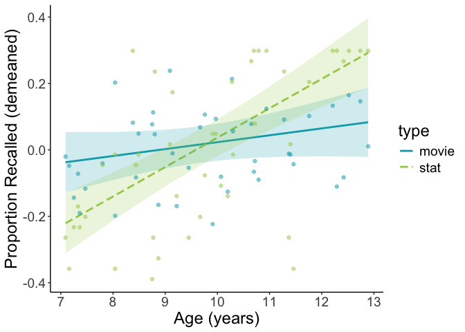
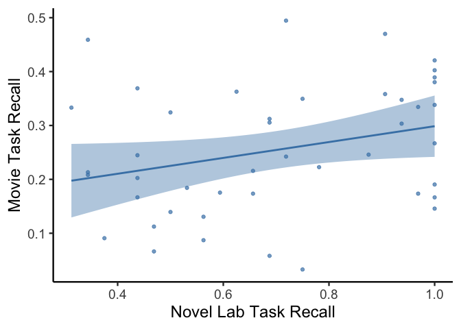

behavioral_analyses
================
2026-01-09

## Behavioral analyses comparing novel experimental task to familiar movie-viewing task

### load data

``` r
df = read.csv('behavior_long_form.csv')

# constrain to developmental group
df <- subset(df, age < 18)

df <- df %>%
  mutate(type = factor(type))  # set factor for novel vs familiar (type)
```

### model age-by-task demands interaction, controlling for sex and adjusting for multiple observations

``` r
m <- lmer(percent ~ age * type + sex + (1 | subject), data = df)
summary(m)
```

    ## Linear mixed model fit by REML. t-tests use Satterthwaite's method [
    ## lmerModLmerTest]
    ## Formula: percent ~ age * type + sex + (1 | subject)
    ##    Data: df
    ## 
    ## REML criterion at convergence: -55.5
    ## 
    ## Scaled residuals: 
    ##     Min      1Q  Median      3Q     Max 
    ## -3.1652 -0.5373  0.1011  0.5265  2.4349 
    ## 
    ## Random effects:
    ##  Groups   Name        Variance Std.Dev.
    ##  subject  (Intercept) 0.002853 0.05341 
    ##  Residual             0.020860 0.14443 
    ## Number of obs: 88, groups:  subject, 44
    ## 
    ## Fixed effects:
    ##              Estimate Std. Error       df t value Pr(>|t|)    
    ## (Intercept)   0.07181    0.13796 81.56468   0.521 0.604086    
    ## age           0.02076    0.01393 81.40208   1.490 0.140068    
    ## typestat     -0.21862    0.18296 41.99996  -1.195 0.238821    
    ## sexM         -0.04392    0.03535 40.99999  -1.242 0.221231    
    ## age:typestat  0.06775    0.01840 41.99996   3.682 0.000656 ***
    ## ---
    ## Signif. codes:  0 '***' 0.001 '**' 0.01 '*' 0.05 '.' 0.1 ' ' 1
    ## 
    ## Correlation of Fixed Effects:
    ##             (Intr) age    typstt sexM  
    ## age         -0.980                     
    ## typestat    -0.663  0.651              
    ## sexM        -0.018 -0.094  0.000       
    ## age:typestt  0.654 -0.660 -0.986  0.000

``` r
# test trajectories in each task individually as well
df_mov = subset(df, type == 'movie')
df_stat = subset(df, type == 'stat')

m <- lm(percent ~ age + sex , data = df_mov)
summary(m)
```

    ## 
    ## Call:
    ## lm(formula = percent ~ age + sex, data = df_mov)
    ## 
    ## Residuals:
    ##      Min       1Q   Median       3Q      Max 
    ## -0.19458 -0.07799 -0.01167  0.07109  0.24259 
    ## 
    ## Coefficients:
    ##             Estimate Std. Error t value Pr(>|t|)  
    ## (Intercept)  0.07358    0.09931   0.741   0.4629  
    ## age          0.02170    0.01006   2.156   0.0370 *
    ## sexM        -0.06932    0.03400  -2.039   0.0479 *
    ## ---
    ## Signif. codes:  0 '***' 0.001 '**' 0.01 '*' 0.05 '.' 0.1 ' ' 1
    ## 
    ## Residual standard error: 0.1108 on 41 degrees of freedom
    ## Multiple R-squared:  0.1604, Adjusted R-squared:  0.1194 
    ## F-statistic: 3.916 on 2 and 41 DF,  p-value: 0.02777

``` r
m <- lm(percent ~ age + sex , data = df_stat)
summary(m)
```

    ## 
    ## Call:
    ## lm(formula = percent ~ age + sex, data = df_stat)
    ## 
    ## Residuals:
    ##      Min       1Q   Median       3Q      Max 
    ## -0.51124 -0.11460  0.02921  0.09795  0.41473 
    ## 
    ## Coefficients:
    ##             Estimate Std. Error t value Pr(>|t|)    
    ## (Intercept) -0.14858    0.16838  -0.882    0.383    
    ## age          0.08757    0.01706   5.132 7.33e-06 ***
    ## sexM        -0.01851    0.05765  -0.321    0.750    
    ## ---
    ## Signif. codes:  0 '***' 0.001 '**' 0.01 '*' 0.05 '.' 0.1 ' ' 1
    ## 
    ## Residual standard error: 0.1879 on 41 degrees of freedom
    ## Multiple R-squared:  0.3921, Adjusted R-squared:  0.3624 
    ## F-statistic: 13.22 on 2 and 41 DF,  p-value: 3.708e-05

### plot behavioral effects

``` r
# demean within task for comparable plotting
df_dm <- df %>%
  group_by(type) %>%
  mutate(percent_dm = percent - mean(percent, na.rm = TRUE)) %>%
  ungroup()

# refit the same formula on the demeaned performance data for plotting
m_dm <- lmer(percent_dm ~ age * type + sex + (1 | subject), data = df_dm)

# generate interaction plot
interact_plot(
  m_dm,
  pred = age,
  modx = type,
  interval = TRUE,
  plot.points = TRUE,
  point.alpha = 0.5,
  colors = c("#00a9b7", "#a6cd57"),
  x.label = "Age (years)",
  y.label = "Proportion Recalled (demeaned)"
) +
  theme_classic() +
  theme(text = element_text(size = 18))
```

<!-- -->

### compare performance across tasks

``` r
df = read.csv('behavior_short_form.csv')

# constrain to developmental group
df <- subset(df, age < 18)
```

### model task effects, controlling for sex

``` r
m <- lm(percent_movie ~ percent_stat + sex, data = df)
summary(m)
```

    ## 
    ## Call:
    ## lm(formula = percent_movie ~ percent_stat + sex, data = df)
    ## 
    ## Residuals:
    ##      Min       1Q   Median       3Q      Max 
    ## -0.19513 -0.07117 -0.01316  0.08069  0.23270 
    ## 
    ## Coefficients:
    ##              Estimate Std. Error t value Pr(>|t|)   
    ## (Intercept)   0.17403    0.05527   3.149  0.00306 **
    ## percent_stat  0.15210    0.07280   2.089  0.04294 * 
    ## sexM         -0.06019    0.03420  -1.760  0.08583 . 
    ## ---
    ## Signif. codes:  0 '***' 0.001 '**' 0.01 '*' 0.05 '.' 0.1 ' ' 1
    ## 
    ## Residual standard error: 0.1123 on 41 degrees of freedom
    ## Multiple R-squared:  0.1491, Adjusted R-squared:  0.1076 
    ## F-statistic: 3.593 on 2 and 41 DF,  p-value: 0.0365

### plot behavior across task

``` r
x <- df$percent_movie
y <- df$percent_stat

ggplot(df, aes(x = y, y = x)) +
  geom_point(alpha = 0.7, color = 'steelblue') +  # scatter
  geom_smooth(method = "lm", se = TRUE, color = "steelblue", fill = 'steelblue') +
  theme_classic(base_size = 18) +
  labs(x = "Novel Lab Task Recall", y = "Movie Task Recall") 
```

    ## `geom_smooth()` using formula = 'y ~ x'

<!-- -->
