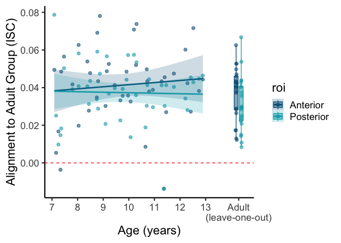
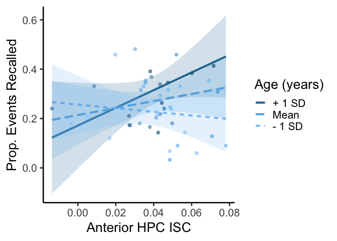

isc_regression
================
2026-01-09

## Compare ISC between children and adults by age and hippocampal subregion, effects on behavior

``` r
data <- read.csv('/Users/owenfriend/Documents/lab_state/final_isc_recall.csv')

sub <- subset(data, age < 18)
adult <- subset(data, age >= 18)
```

### Model ISC by age in each subregion, adjusting for sex, image quality, familiarity with movies

``` r
m <- lm(anterior_mean ~ age + sex + ant_tsnr + ant_nvoxs + movies_seen_before, data = sub)
summary(m)
```

    ## 
    ## Call:
    ## lm(formula = anterior_mean ~ age + sex + ant_tsnr + ant_nvoxs + 
    ##     movies_seen_before, data = sub)
    ## 
    ## Residuals:
    ##       Min        1Q    Median        3Q       Max 
    ## -0.042282 -0.008503  0.002291  0.009238  0.029383 
    ## 
    ## Coefficients:
    ##                      Estimate Std. Error t value Pr(>|t|)    
    ## (Intercept)        -4.053e-02  3.271e-02  -1.239 0.222980    
    ## age                 4.762e-04  1.590e-03   0.299 0.766280    
    ## sexM                3.546e-03  5.688e-03   0.623 0.536710    
    ## ant_tsnr            2.426e-03  6.109e-04   3.971 0.000308 ***
    ## ant_nvoxs          -5.406e-06  6.381e-05  -0.085 0.932936    
    ## movies_seen_before  1.305e-02  5.541e-03   2.356 0.023756 *  
    ## ---
    ## Signif. codes:  0 '***' 0.001 '**' 0.01 '*' 0.05 '.' 0.1 ' ' 1
    ## 
    ## Residual standard error: 0.01695 on 38 degrees of freedom
    ## Multiple R-squared:  0.3302, Adjusted R-squared:  0.2421 
    ## F-statistic: 3.747 on 5 and 38 DF,  p-value: 0.007429

``` r
m <- lm(posterior_mean ~ age + sex + post_tsnr + post_nvoxs + movies_seen_before, data = sub)
summary(m)
```

    ## 
    ## Call:
    ## lm(formula = posterior_mean ~ age + sex + post_tsnr + post_nvoxs + 
    ##     movies_seen_before, data = sub)
    ## 
    ## Residuals:
    ##       Min        1Q    Median        3Q       Max 
    ## -0.046735 -0.006119  0.000858  0.010164  0.035758 
    ## 
    ## Coefficients:
    ##                      Estimate Std. Error t value Pr(>|t|)
    ## (Intercept)        -2.389e-03  3.272e-02  -0.073    0.942
    ## age                -1.055e-04  1.522e-03  -0.069    0.945
    ## sexM               -7.964e-03  5.137e-03  -1.550    0.129
    ## post_tsnr           6.640e-04  4.710e-04   1.410    0.167
    ## post_nvoxs          4.747e-05  5.692e-05   0.834    0.409
    ## movies_seen_before -4.040e-03  5.222e-03  -0.774    0.444
    ## 
    ## Residual standard error: 0.01574 on 38 degrees of freedom
    ## Multiple R-squared:  0.1417, Adjusted R-squared:  0.02877 
    ## F-statistic: 1.255 on 5 and 38 DF,  p-value: 0.3034

    ## 
    ## Attaching package: 'tidyr'

    ## The following objects are masked from 'package:Matrix':
    ## 
    ##     expand, pack, unpack

    ## `geom_smooth()` using formula = 'y ~ x'

<!-- -->

### Relate individual differences in ISC to memory, controlling for sex, image quality, familiarity with movies

``` r
m <- lm(prop_recall ~ posterior_mean + anterior_mean + posterior_mean:age + ant_tsnr + post_tsnr + ant_nvoxs + post_nvoxs +
          age + anterior_mean:age  + movies_seen_before + sex, data = sub)
summary(m)
```

    ## 
    ## Call:
    ## lm(formula = prop_recall ~ posterior_mean + anterior_mean + posterior_mean:age + 
    ##     ant_tsnr + post_tsnr + ant_nvoxs + post_nvoxs + age + anterior_mean:age + 
    ##     movies_seen_before + sex, data = sub)
    ## 
    ## Residuals:
    ##       Min        1Q    Median        3Q       Max 
    ## -0.212554 -0.054709  0.003599  0.067248  0.181517 
    ## 
    ## Coefficients:
    ##                      Estimate Std. Error t value Pr(>|t|)  
    ## (Intercept)         1.926e-01  3.029e-01   0.636   0.5293  
    ## posterior_mean      1.246e+01  6.404e+00   1.946   0.0605 .
    ## anterior_mean      -1.108e+01  5.448e+00  -2.033   0.0504 .
    ## ant_tsnr           -1.906e-02  8.595e-03  -2.217   0.0338 *
    ## post_tsnr           1.302e-02  6.436e-03   2.023   0.0515 .
    ## ant_nvoxs           7.310e-04  4.817e-04   1.517   0.1390  
    ## post_nvoxs         -6.928e-04  4.671e-04  -1.483   0.1478  
    ## age                 2.556e-02  2.401e-02   1.065   0.2950  
    ## movies_seen_before -9.406e-02  4.266e-02  -2.205   0.0348 *
    ## sexM               -5.807e-02  3.785e-02  -1.534   0.1348  
    ## posterior_mean:age -1.357e+00  6.953e-01  -1.951   0.0598 .
    ## anterior_mean:age   1.276e+00  5.895e-01   2.164   0.0380 *
    ## ---
    ## Signif. codes:  0 '***' 0.001 '**' 0.01 '*' 0.05 '.' 0.1 ' ' 1
    ## 
    ## Residual standard error: 0.09984 on 32 degrees of freedom
    ## Multiple R-squared:  0.4348, Adjusted R-squared:  0.2405 
    ## F-statistic: 2.238 on 11 and 32 DF,  p-value: 0.03746

<!-- -->
